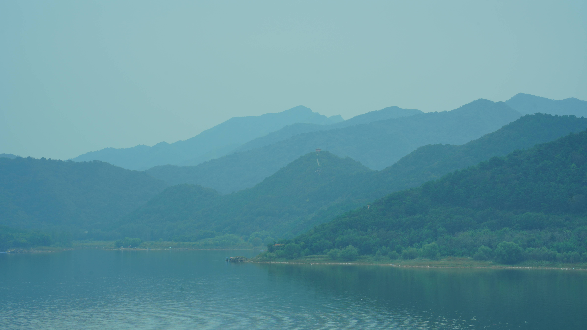

### 基本信息

| 地点 | 中国/北京市/平谷区/金海湖风景区 |
|---|---|
| 时间 | 2025-09-27 |
| 天气 | 阴天，无太阳 |
| 设备 | SONY α7c2 |
| 镜头参数 | 腾龙 28-200 91mm |
| 曝光参数 | f/13 1/100 ISO100 |

### 摄制思路

因为当天没有太阳，云层浓厚，且空气不够透亮，比较远的山看得灰蒙蒙的（如图），但是层层叠叠的山看起来有一种水墨画般的感觉，所以想通过黑白摄影的方式来看看是不是能达到水墨的效果。总体调光和平时的差不多，把调色改成了黑白的。

### 自我评价

实际拍出来的效果吧，天空、远处的山、近处的山、水之间确实形成了颜色的渐变，但是水墨感觉不太突出。而且因为没有云层，山的轮廓比较清晰，缺少说水墨画那种留白感。总的来说，画面虽有一定层次，但是因为过于清晰，缺少一些空白区域的弥补，画面的呼吸感不强，没有达到想要的水墨风格。